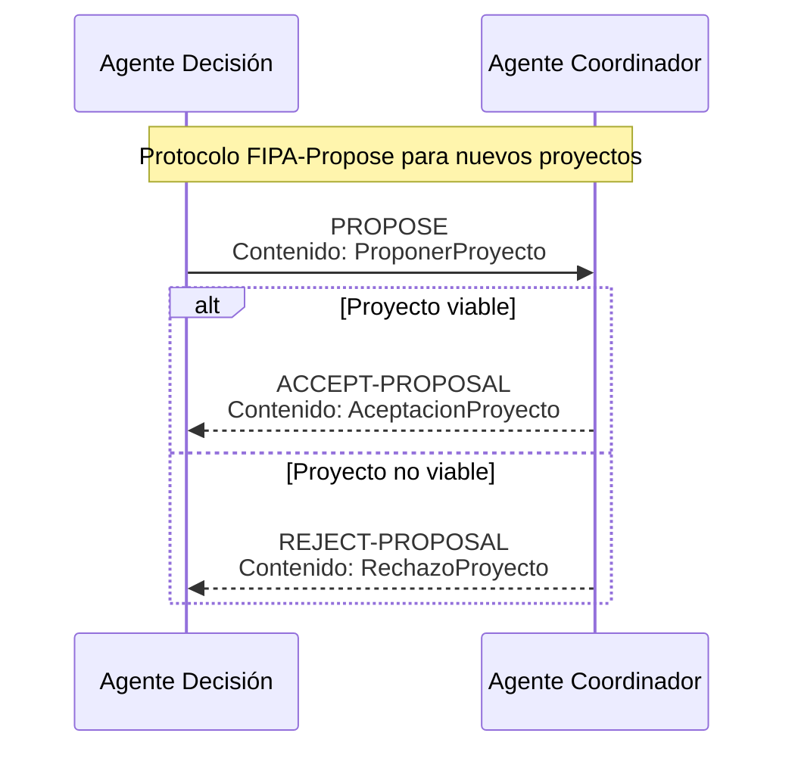
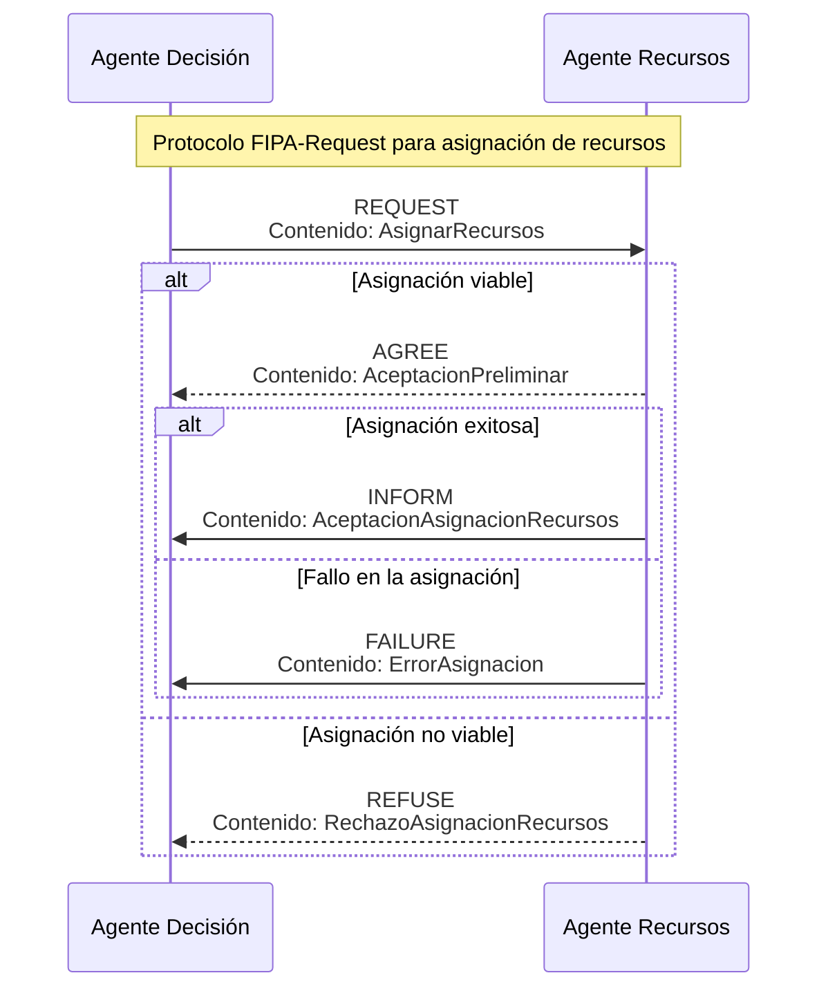
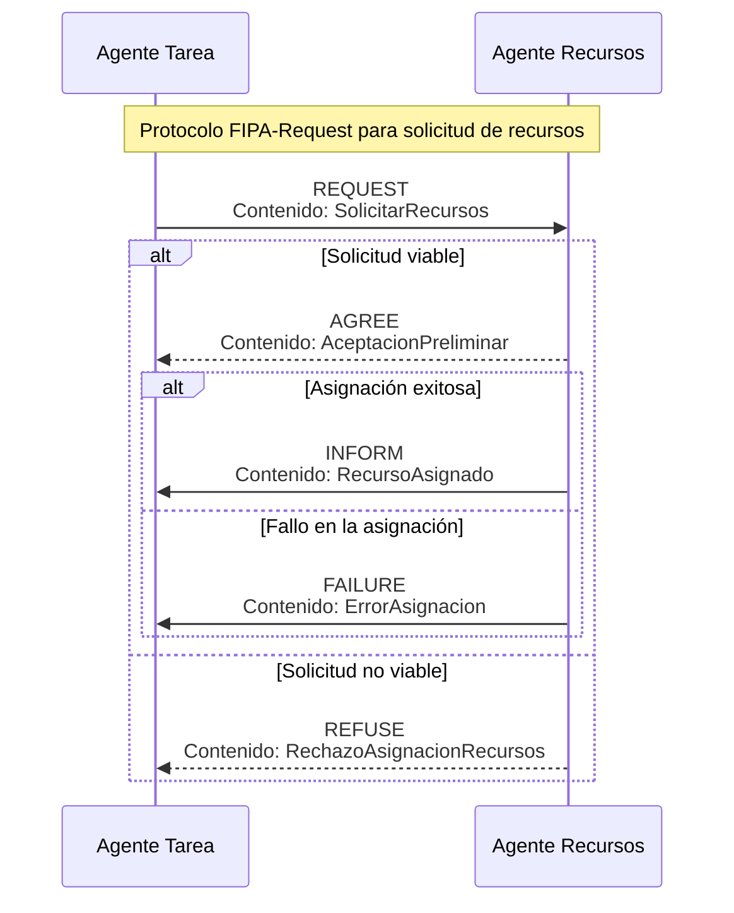
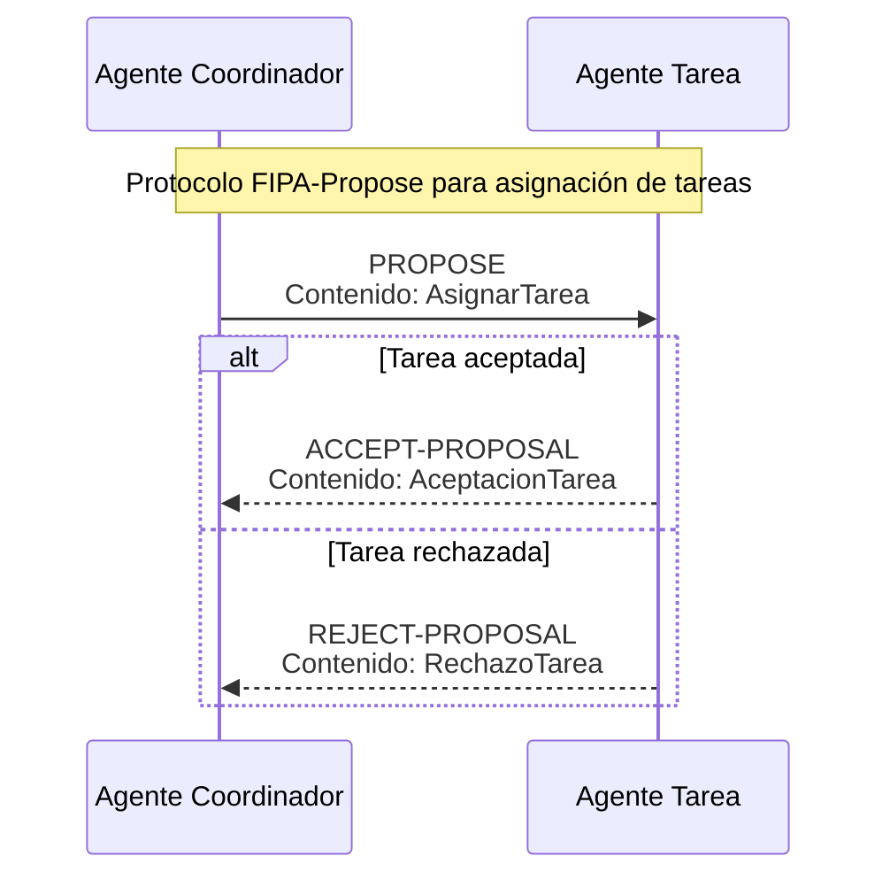
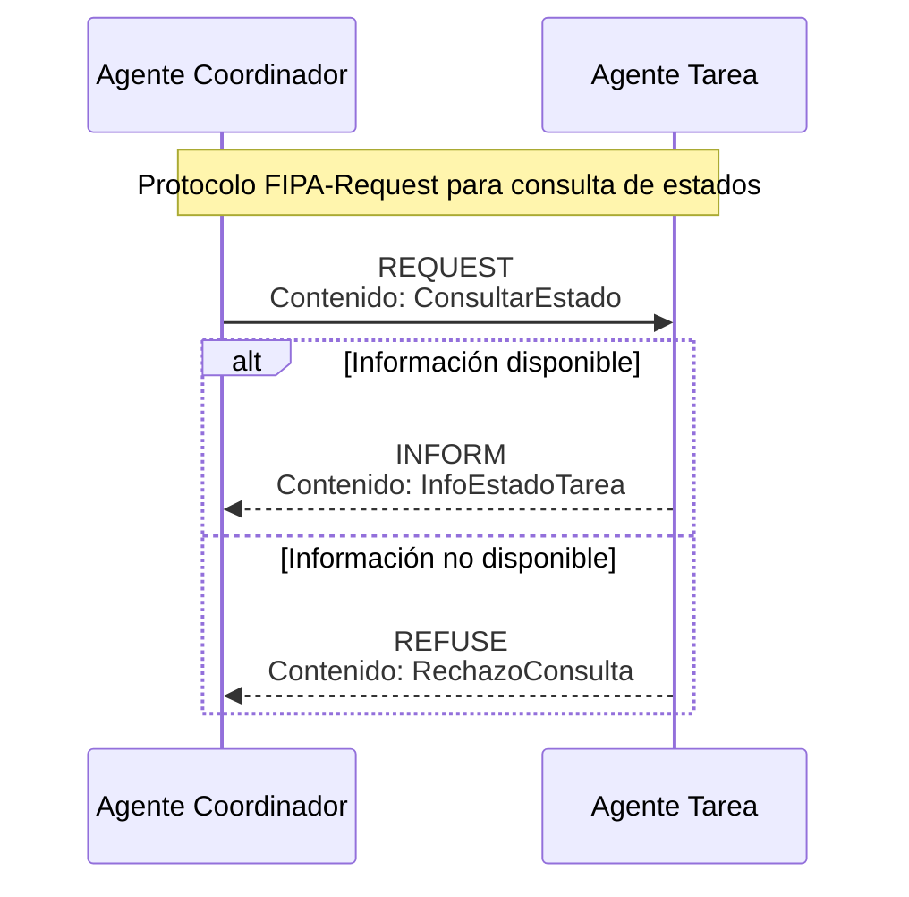
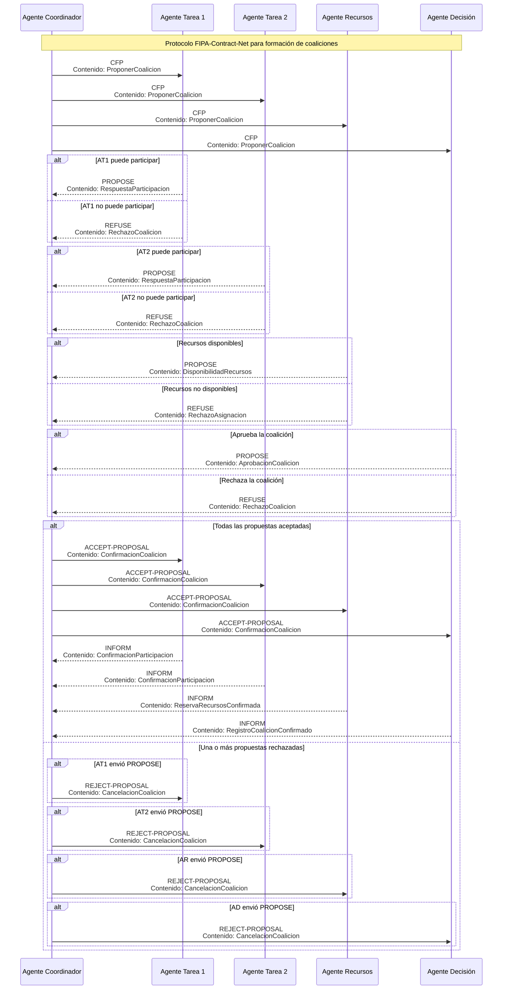
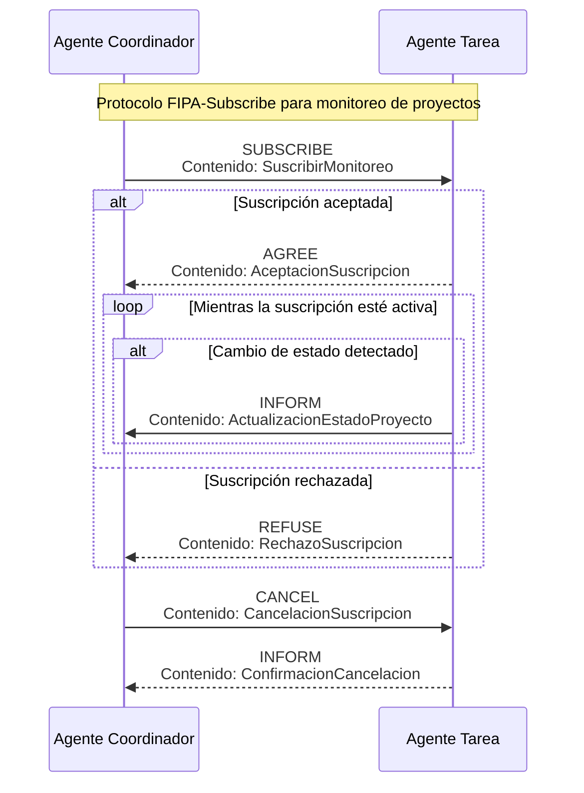

# Ontología para Gestión Colaborativa de Proyectos de Software  
 
## 1. Análisis de la Ontología 

La ontología para el sistema multiagente de gestión colaborativa de proyectos de software debe representar adecuadamente la información intercambiada entre los cuatro tipos de agentes principales (Coordinador, Tarea, Recursos y Decisión), permitiéndoles coordinarse para optimizar recursos y cumplir con los plazos de entrega.

### 1.1 Preguntas de competencia

1.  ¿Cómo identificar y clasificar los diferentes tipos de agentes en el sistema?
2.  ¿Cómo representar los proyectos, sus fases y estados actuales?
3.  ¿Cómo representar las tareas, sus dependencias, estados y requerimientos técnicos?
4.  ¿Cómo representar los recursos disponibles, su estado y asignación?
5.  ¿Cómo gestionar las propuestas de nuevos proyectos?
6.  ¿Cómo solicitar y asignar recursos necesarios para las tareas?
7.  ¿Cómo asignar tareas a los equipos de desarrollo según sus capacidades?
8.  ¿Cómo consultar el estado actual de proyectos y tareas?
9.  ¿Cómo formar coaliciones entre equipos para resolver problemas específicos?
10.  ¿Cómo monitorear proyectos y recibir actualizaciones periódicas?
11.  ¿Cómo representar las prioridades del negocio para la toma de decisiones?
12.  ¿Cómo gestionar conflictos en la asignación de recursos limitados?

Para resolver estas preguntas, se requiere el intercambio de información estructurada entre los agentes. A continuación, se presentan los diagramas AUML para la secuencia de mensajes que deben intercambiarse.

## 2. Diseño de la Ontología

### 2.1 Estructura de la Ontología

La ontología se implementará como una especialización de la clase `BeanOntology` de la biblioteca Jade, organizando los elementos en tres categorías principales:

-   **Concept**: Elementos que representan la información necesaria para el intercambio entre agentes.
-   **AgentAction**: Elementos para el contenido de los mensajes en el inicio de los protocolos.
-   **Predicate**: Elementos que forman el contenido de las respuestas en los protocolos.

El diseño de la ontología incluirá la siguiente estructura de paquetes:

-   `es.ujaen.ssmmaa.onto`: paquete principal de la ontología
    -   `OntoGestionProyectos`: clase que representa la ontología basada en BeanOntology.
    -   `Vocabulario`: interface Java donde se encuentran los elementos de vocabulario utilizados.
-   `es.ujaen.ssmmaa.onto.elementos`: paquete con los elementos de la ontología
    -   Conceptos fundamentales
    -   Actions para iniciar los protocolos
    -   Predicados para las respuestas

### 2.2 Registro en las páginas amarillas

Todos los agentes deberán realizar el registro en las páginas amarillas siguiendo las siguientes indicaciones:

 - El tipo de servicio será para todos los agentes el mismo, `TIPO_SERVICIO`, que se encuentra definido en el vocabulario de la ontología.
 - En nombre del servicio corresponderá al nombre del enumerado, `NombreServicio`, según el agente que se esté registrando en las páginas amarillas. El enumerado también forma parte del vocabulario de la ontología.

## 3. Protocolos de Comunicación

A continuación, se detallan los protocolos de comunicación entre los agentes. En los diagramas se muestran el intercambio de información entre los agentes. En el protocolo se define los elementos de ontología que deberá integrar como parte del contenido de los mensajes. El mensaje inicial será un `AgentAction` y las respuestas son `Predicates`. Para poder componer estos elementos también será necesario definir los `Concept` que formarán parte de cada uno de ellos.

### 3.1 Protocolo FIPA-Propose: Propuesta de Proyectos

### 3.2 Protocolo FIPA-Request: Asignación de Recursos

### 3.3 Protocolo FIPA-Request: Solicitud de Recursos

### 3.4 Protocolo FIPA-Propose: Asignación de Tareas

### 3.5 Protocolo para Consulta de Estados (adaptación FIPA-Request)

### 3.6 Protocolo FIPA-Contract-Net: Formación de Coaliciones

### 3.7 Protocolo FIPA-Subscribe: Monitoreo de Proyectos

